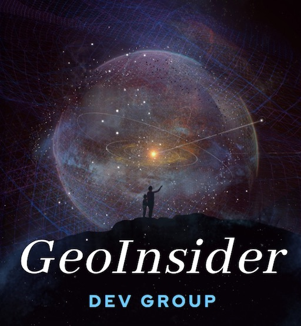

# GeoInsider 动手重现

## Get Started

这里是一种新的尝试，我们将汇集：

* 对地观测领域最火的研究方向的概念、背景知识和代码
* 感兴趣、有沉淀的研究者
* 分析问题所需的总体思维、解决问题所需的数学，以及实现所需的工程技能

魔鬼藏于细节之中，我们将：
* 仔细选择有价值、值得投资时间的待重现论文
* 创建 pair-coding 的 2-3 人小组，共同协同
* 总结知识树，练习 presentation skill
* 与社区分享习得

我们的目标：
* 提供足够的技术深度，从而帮助成员上手、精进，成为一线应用科学家：既理解基础原理，又能够实现并不断改进方法；
* 包含可运行的代码，展示如何在实际中解决问题。可以修改代码、观察结果并及时获取经验；
* 快速迭代内容，紧跟研究领域；
- 由包含有关技术细节问答的网络社区作为补充，使大家可以相互答疑并交换经验。

# 如何参与
* 创建 github 帐号 （如果没有）
* 登录后在[这里](https://github.com/geoinsider/aboutGeoInsider/issues/1)介绍自己的工作领域，设想与兴趣
* 形成项目简要，并与成员协商、对结形成临时项目组
* 项目组一般由 2-3 人组成，可另外安排成员作为 reviewer
* 根据要求和指导意见推进项目，提交代码，回顾和总结

# 委员会职能
* 撰写公共文档与 roadmapping
* 提供专业指导意见
* 技术支持
